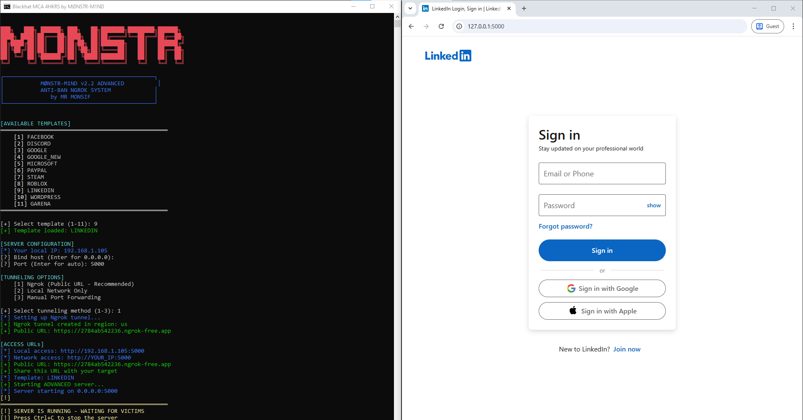

# MØNSTR-PHISH



A simple phishing framework with ready-to-use templates for various platforms. Built with Flask for easy deployment.

## Features
- Multiple phishing templates (Facebook, Discord, Google, etc.)
- Tunnel options: Local, Ngrok (auto-rotate), LocalXpose, Serveo, VPS, Cloudflare
- Logs credentials to `SECURE_DATA/credentials.txt`
- Automatic dependency installation

## Templates
- 1: Facebook
- 2: Discord
- 3: Google
- 4: Google New
- 5: Microsoft
- 6: Paypal
- 7: Steam
- 8: Roblox
- 9: Linkedin
- 10: Wordpress
- 11: Garena

## Installation
1. Clone the repo:
   ```
   git clone https://github.com/monsifhmouri/MONSTR-PHISH.git
   ```
2. Navigate to the directory:
   ```
   cd MONSTR-PHISH
   ```
3. Run the script (it will install missing dependencies like Flask):
   ```
   python setup.py
   ```

## Usage
1. Run `python setup.py`
2. Select a template (e.g., 1 for Facebook)
3. Choose host (default: 0.0.0.0) and port (auto-detected)
4. Select tunnel option (e.g., 2 for Ngrok)
5. Server starts; share the public URL
6. Credentials are captured and saved in `SECURE_DATA/credentials.txt`

For Ngrok/LocalXpose/Serveo, ensure they are installed if needed.

Contact: Telegram @monstr_m1nd  
Donations: BTC 12w4jBxtUopH29c31HVaUxUquwDzGiwk8a
